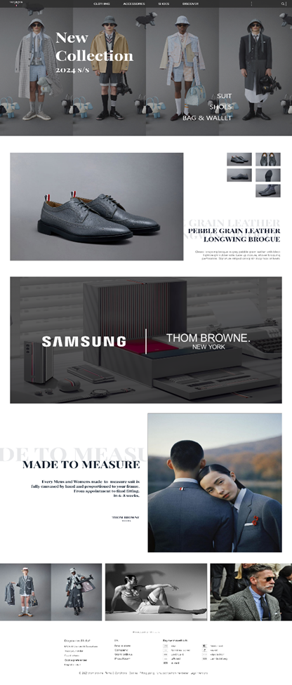

# 톰브라운 *redesign*   

#### "남성"을 주제로 관련 아이템을 선정한 후 선정한 아이템의 홈페이지를 새로운 컨셉에 맞게 리뉴얼 하는 과제   
#### [🚀페이지 방문하기](https://ggang89.github.io/academy_tombrown/)
### ✅ 선정 이유   
  * 남성을 대표하는 옷으로 **정장**을 선택   
    * 2030세대의 **사랑을 받는 브랜드**이자 가장 **이미지가 훼손된 브랜드**   

    | | |
    |:--:|:--:|
    |인간 톰 브라운 | 훼손된 이미지|   

   * 브랜드의 **고급스러움을 강조**하는 디자인 제안   

### ✅ 완성이미지
 

### ✅ 과제 규모 & 역할   
* 팀과제 (3명)
* 역할
   * 자료조사 및 컨셉도출
   * coding : 2, 3page   

### ✅ 기능 
* 2page 
  * 작은 상자 클릭시, 큰 이미지로 보이는 기능   

  ||   |
  |---|---|
 
* 3page   
  * 주요 프로모션 소개 페이지
  * 화면 hover시 색상반전   

  ||   |
  |:---:|:---:|
  |  hover ❌| hover ⭕  |   

### ✅ 기술스택   
HTML ▪ CSS ▪ JavaScript